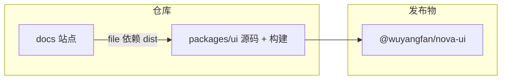

# Nova UI 组件库技术方案（可执行版）

## 1. 文档信息

| 项     | 内容                                                                 |
| ------ | -------------------------------------------------------------------- |
| 范围   | 以 `@wuyangfan/nova-ui`（`packages/ui`）为核心，文档站 `docs`（VitePress + Live）配套 |
| 目标   | 可维护、可 tree-shake、类型友好、文档与行为一致的中后台级 React 组件集 |
| 约束   | Node 20+、npm workspaces；无后端依赖                               |

---

## 2. 总体架构

- **单包发布**：对外一个 NPM 包，内部按目录分域（basic / form / layout / feedback / data / navigation），避免多包版本地狱。
- **文档与库同仓**：API、示例与实现同步；本地通过 `file:../packages/ui` 引用构建产物。
- **构建顺序**：先 `build:ui`，再 `dev:docs` / `build:docs`（见仓库 `AGENTS.md`）。

---

## 3. 包工程与产物

| 项            | 方案                                                         |
| ------------- | ------------------------------------------------------------ |
| 模块格式      | 以 **ESM** 为主；若需 CJS，与 `package.json` 的 `exports` 字段对齐，避免双解析 |
| 类型          | 构建生成 `.d.ts`，与源码 `strict` 策略一致                   |
| Tree-shaking  | `sideEffects` 明确样式入口；避免全仓副作用 import           |
| Peer          | `react`、`react-dom` 列为 peer，版本区间写清                 |
| 入口          | 统一主入口 +（可选）子路径 `exports`，便于按需引用           |

---

## 4. 样式与主题

| 项       | 方案                                                                 |
| -------- | -------------------------------------------------------------------- |
| 技术栈   | 与现状一致：**Tailwind + 工具类**（`cn` / merge），减少 CSS-in-JS 运行时成本 |
| Token    | 颜色、圆角、间距等走 **CSS 变量或 Tailwind 主题扩展**，支持亮/暗     |
| 变体     | 组件级：`variant` / `size` / `color` 等枚举统一命名；复杂组件再拆 slot 类名 |
| 可覆盖   | `className` + 可选 `data-*`（如 `data-variant`）便于业务层写选择器   |
| 样式隔离 | 类名前缀或模块化解耦，避免污染宿主全局样式                           |

---

## 5. 组件设计与 API 规范

以 **Button** 为模板，推广到其它组件：

| 维度     | 规范                                                                 |
| -------- | -------------------------------------------------------------------- |
| DOM 语义 | 默认 `type="button"`；需要导航时用 **`href` + `<a>`** 分支，联合类型区分 `ref` |
| 状态     | `disabled`、`loading` 语义固定（如 loading 时禁止点击 + `aria-busy`） |
| 布局     | `block` 等布局类 props 与视觉 props 分离                            |
| 内容     | `icon` + `iconPosition`；仅图标场景文档强制 **`aria-label`**        |
| 类型     | 继承原生属性时用 `Omit` 解决与业务 props 同名冲突（如 `color`）      |
| Ref      | `forwardRef` 指向真实 DOM，便于焦点与测度                            |

**表单类、反馈类**另增：受控/非受控约定、Portal 容器、`z-index` 与焦点管理（Trap）统一在「反馈层规范」中定义。

---

## 6. 文档与开发者体验

| 项       | 方案                                                                 |
| -------- | -------------------------------------------------------------------- |
| 结构     | VitePress：指南（安装、主题、按需）+ 组件目录 +（可选）迁移         |
| 单组件页 | 示例（基础 / 受控 / 边界）+ **API 表**（类型、默认值、与其它 props 优先级） |
| Live     | `react-live` 限定 scope、错误边界，避免示例崩溃拖垮整页              |
| 站内路径 | 注意 base path（如 `/react-ui-library/`）与资源引用                  |

---

## 7. 质量与测试

| 层级 | 方案                                                                 |
| ---- | -------------------------------------------------------------------- |
| 静态 | ESLint（含 import 顺序）+ TypeScript `strict`                       |
| 单元 | 引入 **Vitest + Testing Library**（当前无测试则作为独立里程碑）     |
| 无障碍 | 关键组件清单 + 可选 `axe` 抽检；弹层类必测键盘与焦点                 |
| CI   | `lint:ui` + `typecheck:ui` +（后续）`test` + `build:ui` 全绿再合并   |

---

## 8. 版本与发布

| 项   | 方案                                       |
| ---- | ------------------------------------------ |
| 版本 | SemVer；破坏性变更走大版本                 |
| 记录 | CHANGELOG + Conventional Commits           |
| 体积 | 可选 `size-limit` 或定期 bundle 分析       |

---

## 9. 与 Next.js 等框架（可选扩展）

- 客户端组件边界：需交互、DOM、状态的组件在文档中标注 **`use client`** 使用方式。
- SSR：避免在 render 路径直接使用 `window` / `document`；Portal 在 `useEffect` 或守卫后挂载。
- 独立一页「框架集成」说明 `transpilePackages`、样式引入顺序等。

---

## 10. 实施路线（里程碑）

| 阶段 | 内容                                                         | 验收                 |
| ---- | ------------------------------------------------------------ | -------------------- |
| M0   | 包构建、`exports`、严格 TS、Lint CI                         | 可稳定 `build:ui`    |
| M1   | 基础件（Button、Typography、Layout、Icon）+ 主题切换示例     | 文档与类型一致       |
| M2   | 表单核心（Input、Select、Checkbox、Form 模型）               | 受控与校验展示统一   |
| M3   | 反馈与导航（Modal、Drawer、Tooltip、Dropdown）               | 焦点与层级统一       |
| M4   | 数据展示（Table、Pagination、Empty…）                        | 大数据与空态规范     |
| M5   | 测试与 a11y 硬化、体积门禁                                   | 指标可量化           |

---

## 11. 风险与对策

| 风险         | 对策                                       |
| ------------ | ------------------------------------------ |
| API 漂移     | API 表由类型或单源生成（后续可接脚本）     |
| 样式膨胀     | Token 收敛 + 禁止组件内魔法数              |
| 文档与包不同步 | 同 PR 要求改组件必改对应 `.md`           |
| 破坏性改动   | RFC + 迁移段 + 版本号                      |

---

## 12. 结论

本方案以 **「单包 + 严格类型 + Tailwind 主题 + VitePress 文档 + 渐进式测试」** 为技术主线，用 **Button 级 API 规范** 复制到全库，在不大改仓库形态的前提下把组件库推到可对外发布、可长期演进的状态。

后续可将某一里程碑（例如仅 **M0 + M1**）拆成任务列表，并对照 `packages/ui` 目录做差距分析。
